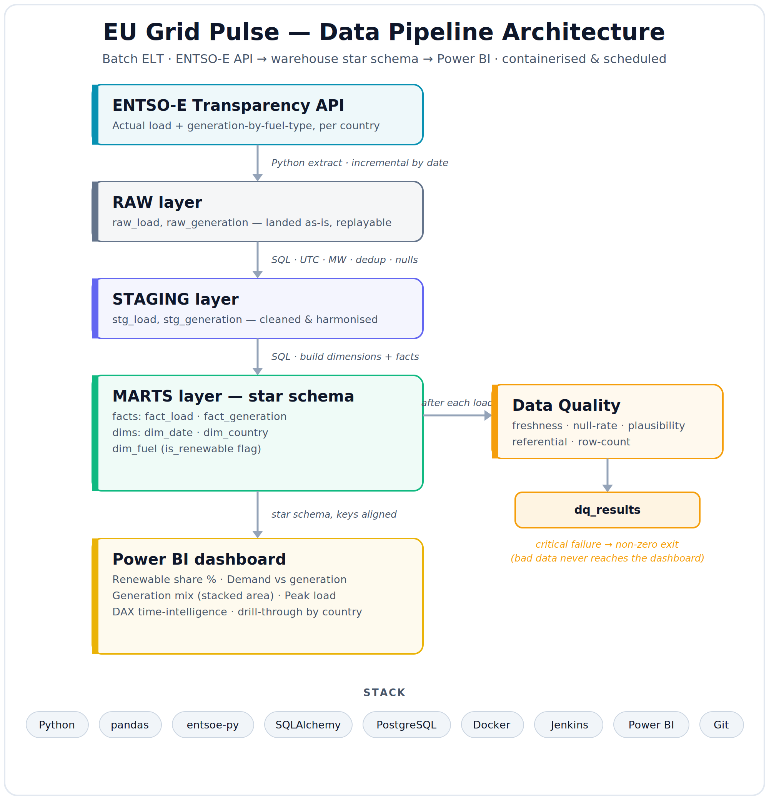

<div align="center">

# âš¡ EU Grid Pulse

**An end-to-end batch pipeline for European electricity data —
from raw grid readings to a decision-ready dashboard.**

It pulls real electricity **demand** and **generation-by-fuel-type** for several
European countries from the ENTSO-E Transparency API, harmonises the messy
real-world data, models it into a warehouse star schema, checks its quality on
every load, and serves it through Power BI. The whole thing is containerised and
scheduled.


</div>

<p align="center">
  
</p>

---

## Why this project

Europe's power system is changing fast, and the questions people care about are
data questions: *How much of today's electricity was renewable? When does demand
peak? How does the fuel mix differ between countries?*

Answering them means wrangling data that is genuinely awkward — different time
zones, daylight-saving jumps, 15-minute vs hourly readings, and generation
columns that vary by country. **EU Grid Pulse turns that mess into clean,
analytics-ready tables** and a dashboard anyone can read.

## What it does, in one glance

- **Ingests** actual load + generation-by-fuel for several countries
  (Germany-Luxembourg, France, Netherlands, Spain, Poland).
- **Lands it raw**, then **harmonises** it — timestamps to UTC, units to MW,
  de-duplicated, nulls handled explicitly.
- **Models** it into a star schema built for analytics.
- **Guards** every load with automated data-quality checks.
- **Serves** renewable share %, demand vs generation, fuel mix, and peak load in
  a Power BI dashboard.

## How the data flows (medallion pattern)

The pipeline moves data through four layers, each with one clear job. This
"raw → harmonised → modelled" shape is the standard way to keep a warehouse
trustworthy: the raw copy stays honest and replayable, and all the messy fixes
live in one well-documented place.

| Layer | What happens here | Output |
|-------|-------------------|--------|
| **Raw** | Land the API response exactly as pulled — no cleaning. An honest, replayable copy. | `raw_load`, `raw_generation` |
| **Staging** | Convert timestamps to a single UTC column, standardise units to MW, map zone codes to country names, normalise fuel labels, de-duplicate overlapping re-pulls, handle nulls. | `stg_load`, `stg_generation` |
| **Marts** | Build the star schema — facts joined to clean dimensions, ready for BI. | `fact_load`, `fact_generation`, `dim_date`, `dim_country`, `dim_fuel` |
| **Data quality** | After each load, run checks (freshness, null-rate, plausibility, referential, row-count) and record the results. A critical failure stops bad data reaching the dashboard. | `dq_results` |

## Tech stack

**Python** (pandas, entsoe-py, SQLAlchemy) · **PostgreSQL** (in Docker) ·
**Power BI** · **Docker** · **Jenkins** · **Git**

## Repository structure

````
eu-grid-pulse/
├── config/countries.yml          # which countries / bidding zones to pull
├── src/
│   ├── ingest/extract_entsoe.py  # API → raw dataframes (incremental)
│   ├── load/load_raw.py          # dataframes → warehouse raw tables
│   ├── quality/checks.py         # data-quality checks → dq_results
│   └── pipeline.py               # runs the whole thing end to end
├── sql/
│   ├── 01_raw.sql                # raw table DDL
│   ├── 02_staging.sql            # cleaning + harmonisation
│   ├── 03_marts.sql              # star schema build
│   └── 04_dq.sql                 # dq_results + SQL checks
├── docker-compose.yml            # Postgres warehouse
├── Dockerfile                    # image that runs the pipeline
├── Jenkinsfile                   # scheduled orchestration
├── dashboards/                   # Power BI file lives here
└── docs/architecture.png         # the diagram above
````

## Getting started

### Prerequisites

- **Python 3.11+**
- **Docker Desktop** (running) — hosts the PostgreSQL warehouse
- **An ENTSO-E API token** — free; register on the ENTSO-E Transparency Platform
  and request a security token from your account settings
- **Power BI Desktop** (Windows) — only needed for the dashboard

### 1. Install dependencies

````bash
python -m venv .venv
source .venv/bin/activate      # Windows (Git Bash): source .venv/Scripts/activate
pip install -r requirements.txt
````

### 2. Configure your environment

````bash
cp .env.example .env
````

Open `.env` and set your `ENTSOE_TOKEN`. The `DATABASE_URL` is pre-filled for the
Docker Postgres below. `.env` is gitignored, so your token never gets committed.

### 3. Start the warehouse

````bash
docker compose up -d
````

### 4. Create the raw tables

````bash
docker compose exec -T postgres psql -U grid -d eu_grid_pulse < sql/01_raw.sql
````

### 5. Confirm the API connection

````bash
python -m src.ingest.extract_entsoe --smoke-test
````

If a table of German load prints, your token and setup are working.

## Data quality

Every load is checked before its data can be trusted. Results are written to a
`dq_results` table so quality is auditable over time.

| Check | What it catches |
|-------|-----------------|
| **Freshness** | Data hasn't gone stale — the latest reading is recent. |
| **Null rate** | Too many missing `load_mw` / `generation_mw` values. |
| **Plausibility** | Impossible numbers (negatives, absurd highs). |
| **Referential** | Every fact key exists in its dimension. |
| **Row count** | The load actually added rows. |

A **critical** failure exits non-zero, so bad data never reaches the dashboard.

## Design notes (the hard parts)

- **Time is the enemy.** Countries report in different time zones and at
  different resolutions (15-minute vs hourly), and some timestamps land on
  daylight-saving boundaries. Everything is normalised to a single UTC column in
  staging, where the logic is visible and commented.
- **Idempotent + incremental.** Runs pull only new dates (via a per-country
  watermark) and re-running never duplicates data — overlapping re-pulls are
  de-duplicated in staging using each row's ingestion timestamp.
- **Raw stays raw.** No cleaning happens at the raw layer on purpose; it's a
  faithful, replayable snapshot of the source.

## Project status

Built in the open, one clean layer at a time.

| Component | Status |
|-----------|--------|
| Project scaffold + Dockerised Postgres | ✅ Done |
| Raw-layer tables (`raw_load`, `raw_generation`) | ✅ Done |
| ENTSO-E ingestion (incremental) | íº§ In progress |
| Staging — harmonisation & dedup | ⬜ Planned |
| Marts — star schema | ⬜ Planned |
| Data-quality layer | ⬜ Planned |
| Orchestration (Docker + Jenkins) | ⬜ Planned |
| Power BI dashboard | ⬜ Planned |

## License

Released under the MIT License — see [LICENSE](LICENSE).
