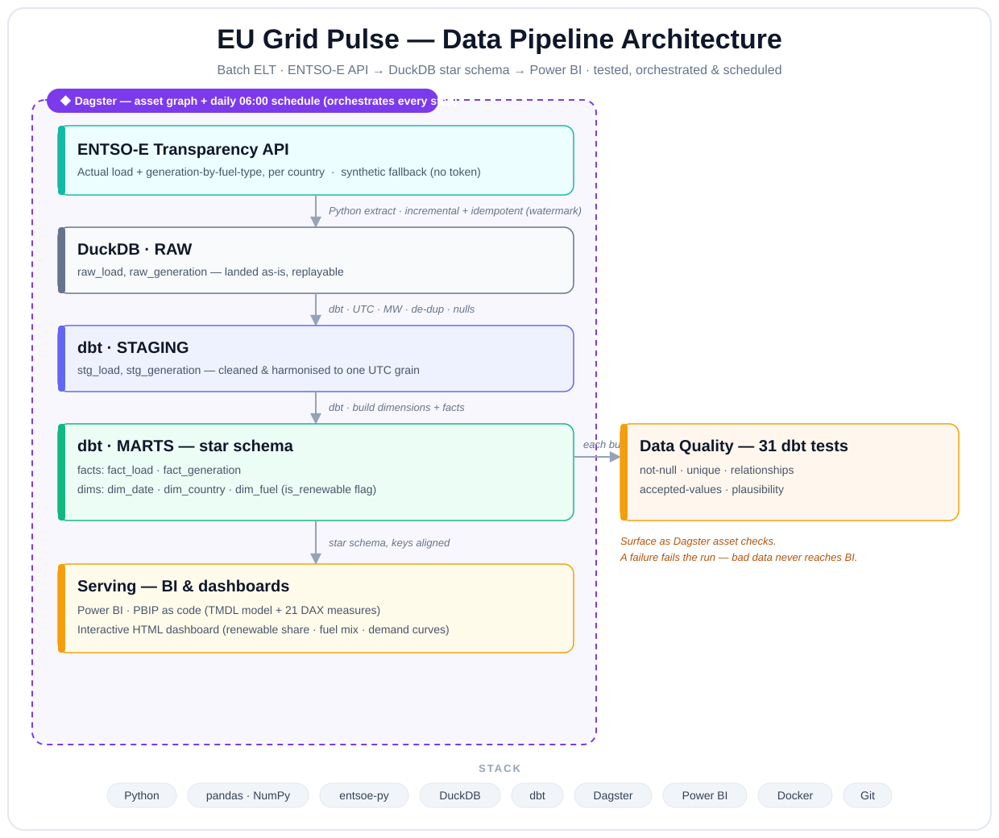
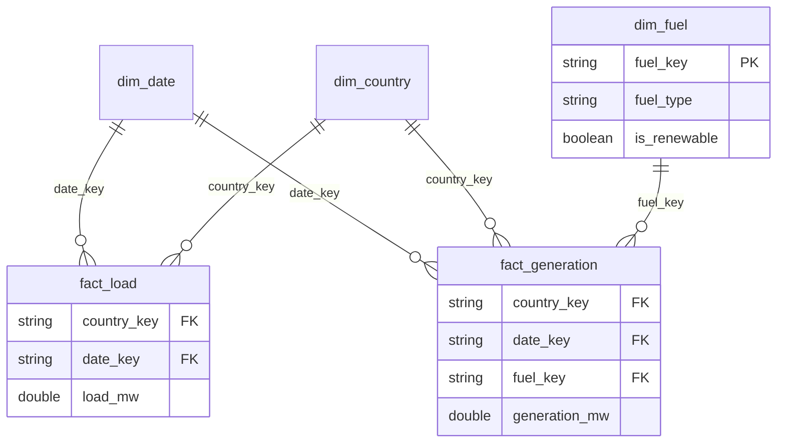

<div align="center">

# ⚡ EU Grid Pulse

**An end-to-end, modern data-engineering pipeline for European electricity data —
from raw grid readings to a decision-ready dashboard, fully orchestrated and tested.**

Pulls real electricity **demand** and **generation-by-fuel-type** for five European
countries from the **ENTSO-E Transparency API**, harmonises the messy real-world
data, models it into a warehouse **star schema**, guards every load with automated
**data-quality tests**, orchestrates the whole thing as a **Dagster asset graph**,
and serves it through **Power BI** and an interactive dashboard.


</div>

<p align="center">
  
</p>

---

## Why this project

Europe's power system is changing fast, and the questions people care about are data
questions: *How much of today's electricity was renewable? When does demand peak? How
does the fuel mix differ between countries?*

Answering them means wrangling genuinely awkward data — different time zones,
daylight-saving jumps, 15-minute vs hourly readings, and generation columns that vary
by country. **EU Grid Pulse turns that mess into clean, analytics-ready tables** and a
dashboard anyone can read — and it does it the way a modern data team would: version-
controlled transformations, tested at every layer, orchestrated and observable.

## Architecture

The pipeline follows the **medallion pattern** (raw → staging → marts). The raw copy
stays honest and replayable; all the messy fixes live in one well-documented staging
layer; the marts are a clean star schema built for BI.

| Layer | What happens here | Output |
|-------|-------------------|--------|
| **Raw** | Land the API response exactly as pulled — no cleaning. An honest, replayable copy. | `raw_load`, `raw_generation` |
| **Staging** (dbt) | Timestamps → a single UTC column, units → MW, zone codes → country names, fuel labels normalised, overlapping re-pulls de-duplicated, nulls handled explicitly. | `stg_load`, `stg_generation` |
| **Marts** (dbt) | Build the star schema — facts joined to clean dimensions, ready for BI. | `fact_load`, `fact_generation`, `dim_date`, `dim_country`, `dim_fuel` |
| **Data quality** (dbt tests) | 31 tests run on every build (not-null, unique, referential, plausibility). A failure fails the run, so bad data never reaches the dashboard. | asset checks in Dagster |

## Data model (star schema)


```mermaid
erDiagram
    dim_date    ||--o{ fact_load : date_key
    dim_country ||--o{ fact_load : country_key
    dim_date    ||--o{ fact_generation : date_key
    dim_country ||--o{ fact_generation : country_key
    dim_fuel    ||--o{ fact_generation : fuel_key

    fact_load {
        string country_key FK
        string date_key FK
        double load_mw
    }
    fact_generation {
        string country_key FK
        string date_key FK
        string fuel_key FK
        double generation_mw
    }
    dim_fuel {
        string fuel_key PK
        string fuel_type
        boolean is_renewable
    }
```

- **Grain:** `fact_load` = country × hour; `fact_generation` = country × hour × fuel.
- `dim_fuel.is_renewable` is the single flag that powers the renewable-share story
  (nuclear is low-carbon but *not* renewable, by convention).

## Tech stack

**Python 3.10** (pandas + NumPy, entsoe-py) · **DuckDB** (warehouse) ·
**dbt** (transformations + tests) · **Dagster** (orchestration) ·
**Power BI** (PBIP "as code" + DAX) · **Git**

> **Why these choices:** the ENTSO-E source is *batch* and the volume is small, so the
> stack is deliberately a clean batch stack — no Spark/Kafka shoehorned in where they
> don't belong. DuckDB keeps it server-less and reproducible while the dbt models stay
> portable to Postgres/BigQuery. Every choice is defensible, which is the point.

## Quickstart

No Docker required — the warehouse is a single DuckDB file, and the pipeline runs on a
realistic **synthetic data generator** out of the box, so you can run the whole thing
with no API token.

```bash
# 1. environment
python -m venv .venv
source .venv/Scripts/activate          # Windows: .venv\Scripts\activate
pip install -r requirements.txt

# 2. run the whole pipeline (ingest → dbt build → dashboard → Power BI export)
python -m src.run_pipeline

# 3. or drive it from the Dagster UI (asset graph, run from the browser)
dagster dev -m src.dagster_defs         # then open http://localhost:3000
```

**To use live ENTSO-E data:** request a free API token from the ENTSO-E Transparency
Platform, set `ENTSOE_TOKEN` in `.env`, delete `data/eu_grid_pulse.duckdb`, and re-run.
The real-API code path activates automatically when a token is present.

## Orchestration (Dagster)

The entire pipeline is one **asset graph**: `raw_load`/`raw_generation` →
dbt models (`stg_*` → `dim_*`/`fact_*`) → `dashboard` + `powerbi_export`. The dbt
project is loaded via `dagster-dbt`, so each model is a Dagster asset and all **31 dbt
tests surface as asset checks**. A daily schedule (06:00) re-materialises everything
incrementally. `dagster dev -m src.dagster_defs` opens the lineage UI.

## Dashboards

- **Power BI** — a complete **PBIP project** (`powerbi/`) authored as code in TMDL: the
  star-schema model, relationships, and **21 DAX measures** (renewable share %,
  low-carbon share, load factor, self-sufficiency, `RANKX`/`TOPN` patterns, 7-day
  rolling average, peak-hour). Open `powerbi/EUGridPulse.pbip` in Power BI Desktop.
  See [docs/POWERBI.md](docs/POWERBI.md).
- **HTML dashboard** — `dashboards/index.html`, generated from the marts (renewable
  share by country, fuel mix, demand vs generation, diurnal demand curve).

## Repository structure

```
eu-grid-pulse/
├── src/
│   ├── ingest/extract_entsoe.py   # ENTSO-E API → raw frames (real + synthetic)
│   ├── ingest/synthetic.py        # vectorised, realistic fallback data (no token)
│   ├── load/load_raw.py           # frames → DuckDB raw tables (+ watermark)
│   ├── warehouse.py               # DuckDB connection helper
│   ├── dashboard.py               # marts → HTML dashboard
│   ├── export_powerbi.py          # marts → Parquet/CSV for Power BI
│   ├── run_pipeline.py            # no-UI orchestrator (end to end)
│   └── dagster_defs.py            # Dagster asset graph + daily schedule
├── dbt/                           # dbt project: staging + marts models + 31 tests
├── powerbi/                       # PBIP (TMDL model + DAX) + measures.dax
├── dashboards/index.html          # generated dashboard
├── config/countries.yml           # bidding zones to pull
└── docs/                          # KT.md (hand-off) · POWERBI.md (build guide)
```

## Project status

| Component | Status |
|-----------|--------|
| Project scaffold + warehouse (DuckDB) | ✅ Done |
| Ingestion — incremental + idempotent (real API path + synthetic) | ✅ Done |
| Staging — harmonisation & de-dup (dbt) | ✅ Done |
| Marts — star schema (dbt) | ✅ Done |
| Data-quality layer — 31 dbt tests | ✅ Done |
| Orchestration — Dagster asset graph + schedule | ✅ Done |
| Power BI — PBIP model + 21 DAX measures | ✅ Done |
| HTML dashboard | ✅ Done |
| Live ENTSO-E data (pending free API token) | 🚧 Token requested |

> **Note on data:** the pipeline ships with a realistic synthetic generator so it runs
> end-to-end with no credentials. The country fuel-mix profiles are characteristic of
> the real grids (France nuclear-heavy, Poland coal-heavy, Spain solar/wind). Swapping
> in a live ENTSO-E token changes nothing downstream.

## Design notes (the hard parts)

- **Time is the enemy.** Countries report in different time zones and resolutions
  (15-min vs hourly), some on DST boundaries. Everything is normalised to a single UTC
  column in staging, where the logic is visible and commented.
- **Idempotent + incremental.** Runs pull only new dates (per-country watermark);
  re-running never duplicates data — overlapping re-pulls are de-duplicated in staging
  by ingestion timestamp.
- **Raw stays raw.** No cleaning at the raw layer, on purpose — a faithful, replayable
  snapshot of the source.

## License

Released under the MIT License — see [LICENSE](LICENSE).
