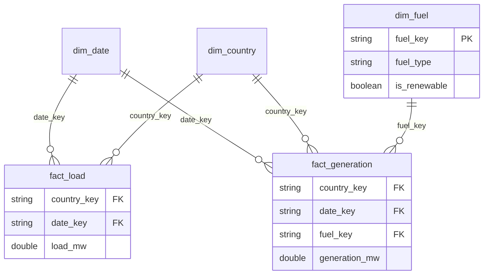

<div align="center">

# ⚡ EU Grid Pulse

**Live European electricity data, taken from a raw API all the way to a tested dashboard.**


</div>

<p align="center">
  
</p>

EU Grid Pulse pulls electricity **demand** and **generation by fuel type** for five European
countries from the [ENTSO-E Transparency API](https://transparency.entsoe.eu/). It cleans the
awkward parts of that data (time zones, daylight-saving jumps, a mix of 15-minute and hourly
readings), models everything into a warehouse **star schema**, and checks it with **31 automated
tests** on every run. The flow runs as a **Dagster** asset graph and lands in **Power BI** and an
interactive dashboard.

---

## Proven on live data

These numbers come from a real run against the live ENTSO-E API, not a mock-up.

| Metric | Result |
|---|---|
| Source | ENTSO-E Transparency API (live token) |
| Bidding zones | 5: Germany-Luxembourg, France, Netherlands, Spain, Poland |
| Backfill window | 30 days |
| Raw rows ingested | **~229,000** |
| Fuel types captured | **21** |
| Resolution handled | 15-minute and hourly (varies by zone) |
| dbt models built | 7 |
| dbt tests passing | **31 / 31** |
| Pipeline exit status | 0 (clean) |

And the headline question the project exists to answer, how green was each grid over the window:

| Country | Renewable share |
|---|---|
| 🇩🇪 Germany-Luxembourg | **59.5%** |
| 🇪🇸 Spain | **52.9%** |
| 🇵🇱 Poland | 33.2% |
| 🇫🇷 France | 21.2% *(nuclear-heavy, so low on renewables but very low-carbon)* |
| 🇳🇱 Netherlands | 20.0% |

Those figures match the real European picture, which is the quickest sanity check that the
modelling is correct. Run it without a token and it falls back to a realistic synthetic
generator, so anyone can clone the repo and reproduce the pipeline with no credentials.

## Why I built it

Europe's power system is shifting fast, and the interesting questions are all data questions.
How much of today's electricity was renewable? When does demand peak? How different is the fuel
mix from one country to the next? Answering them means wrangling data that fights back: every
country reports on its own clock, at its own resolution, with generation columns that differ by
zone. This project turns that mess into clean, analytics-ready tables and a dashboard anyone can
read, built the way a working data team would build it: version-controlled transformations,
tested at every layer, orchestrated and observable.

## How the data flows

The pipeline uses the medallion pattern: raw, then staging, then marts. The raw copy stays
untouched so it can always be replayed. All the cleaning lives in one documented staging layer.
The marts are a tidy star schema aimed at BI.

| Layer | What happens | Output |
|-------|--------------|--------|
| **Raw** | Land the API response exactly as it arrives. No cleaning. | `raw_load`, `raw_generation` |
| **Staging** (dbt) | Timestamps to a single UTC column, units to MW, zone codes to country names, fuel labels normalised, overlapping re-pulls de-duplicated, nulls handled on purpose. | `stg_load`, `stg_generation` |
| **Marts** (dbt) | Build the star schema: facts joined to clean dimensions, ready for BI. | `fact_load`, `fact_generation`, `dim_date`, `dim_country`, `dim_fuel` |
| **Data quality** (dbt tests) | 31 tests on every build. A failure stops the run before bad data reaches the dashboard. | asset checks in Dagster |

## Data model


```mermaid
erDiagram
    dim_date    ||--o{ fact_load : date_key
    dim_country ||--o{ fact_load : country_key
    dim_date    ||--o{ fact_generation : date_key
    dim_country ||--o{ fact_generation : country_key
    dim_fuel    ||--o{ fact_generation : fuel_key

    fact_load {
        string country_key FK
        string date_key FK
        double load_mw
    }
    fact_generation {
        string country_key FK
        string date_key FK
        string fuel_key FK
        double generation_mw
    }
    dim_fuel {
        string fuel_key PK
        string fuel_type
        boolean is_renewable
    }
```

`fact_load` is grained at country by hour; `fact_generation` at country by hour by fuel. The
`is_renewable` flag on `dim_fuel` drives the renewable-share numbers. Nuclear counts as
low-carbon but not renewable, which is why France reads low on that metric.

## Tech stack

**Python 3.10** (pandas, NumPy, entsoe-py) · **DuckDB** warehouse · **dbt** for transformations
and tests · **Dagster** for orchestration · **Power BI** (PBIP as code with DAX) · **Git**.

The source is batch and the volume is modest, so the stack is a clean batch stack with nothing
heavier bolted on for show. DuckDB keeps it server-less and reproducible, and because the models
are plain dbt SQL they port to Postgres or BigQuery by swapping one profile.

## Quickstart

No database server and no Docker. The warehouse is a single DuckDB file, and the pipeline runs
on a synthetic generator out of the box, so you can try it without an API token.

```bash
# 1. environment
python -m venv .venv
source .venv/Scripts/activate          # Windows: .venv\Scripts\activate
pip install -r requirements.txt

# 2. run everything (ingest -> dbt build -> dashboard -> Power BI export)
python -m src.run_pipeline

# 3. or drive it from the Dagster UI
dagster dev -m src.dagster_defs         # then open http://localhost:3000
```

For live data, request a free token from the ENTSO-E Transparency Platform, set `ENTSOE_TOKEN`
in `.env`, delete `data/eu_grid_pulse.duckdb`, and run again. The real path activates on its own
when a token is present, and it skips any recent window ENTSO-E has not published yet rather than
failing the run.

## Orchestration

The whole pipeline is one Dagster asset graph: `raw_load` and `raw_generation`, then the dbt
models (`stg_*`, then `dim_*` and `fact_*`), then `dashboard` and `powerbi_export`. The dbt
project loads through `dagster-dbt`, so each model is an asset and all 31 dbt tests appear as
asset checks. A daily schedule rebuilds everything incrementally. `dagster dev -m src.dagster_defs`
opens the lineage view.

## Dashboards

- **Power BI**: a full PBIP project (`powerbi/`) written as code in TMDL: the star-schema model,
  the relationships, and 21 DAX measures (renewable share, low-carbon share, load factor,
  self-sufficiency, country ranking, a 7-day rolling average, peak hour, and more). Open
  `powerbi/EUGridPulse.pbip` in Power BI Desktop. Guide: [docs/POWERBI.md](docs/POWERBI.md).
- **HTML dashboard**: `dashboards/index.html`, generated from the marts: renewable share by
  country, fuel mix, demand versus generation, and the daily demand curve.

## Repository layout

```
eu-grid-pulse/
├── src/
│   ├── ingest/extract_entsoe.py   # ENTSO-E API -> raw frames (live + synthetic)
│   ├── ingest/synthetic.py        # vectorised fallback data (no token needed)
│   ├── load/load_raw.py           # frames -> DuckDB raw tables (+ watermark)
│   ├── warehouse.py               # DuckDB connection helper
│   ├── dashboard.py               # marts -> HTML dashboard
│   ├── export_powerbi.py          # marts -> Parquet/CSV for Power BI
│   ├── run_pipeline.py            # no-UI orchestrator (end to end)
│   └── dagster_defs.py            # Dagster asset graph + daily schedule
├── dbt/                           # dbt project: staging + marts models + 31 tests
├── powerbi/                       # PBIP (TMDL model + DAX) + measures.dax
├── dashboards/index.html          # generated dashboard
├── config/countries.yml           # bidding zones to pull
└── docs/                          # KT.md (hand-off) · POWERBI.md (build guide)
```

## The hard parts

- **Time.** Countries report in different time zones and resolutions, some on daylight-saving
  boundaries. Staging normalises everything to one UTC column, with the logic in plain sight.
- **Idempotent and incremental.** Each run reads a per-country watermark and pulls only newer
  dates. Re-running never double-counts: overlapping re-pulls are de-duplicated in staging by
  ingestion time.
- **Late data.** ENTSO-E often has not published the most recent hour yet. Ingestion skips that
  series for the run instead of erroring out, so a scheduled run is never brittle.

## License

MIT. See [LICENSE](LICENSE).
